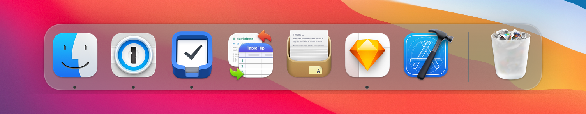
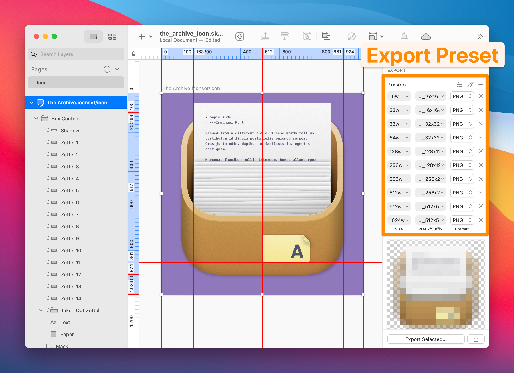

# Alternate Icon for The Archive App

[![CC BY 4.0][cc-by-shield]][cc-by]



An alternate icon for [The Archive App](https://zettelkasten.de/the-archive/) matching the macOS Big Sur aesthetic whilst incorporating elements of the original icon.

### About The Icon

The icon was made entirely in [Sketch](https://www.sketch.com). I used this [template from Apply Pixels](https://applypixels.com/resource/macos11-app-icon-lite) and tried capuring the *meaning* of the original icon.

### Creating the Icon File



I have created an [export preset](https://www.sketch.com/docs/exporting/#how-to-create-and-use-export-presets) which exports `.png` files in an [Icon Set](https://developer.apple.com/library/archive/documentation/Xcode/Reference/xcode_ref-Asset_Catalog_Format/IconSetType.html) which is used by the `./build-icon` script

```bash
iconutil -c icns -o The\ Archive.icns The\ Archive.iconset
```

to create the `.icns` file.

### Credit

Wood pattern by [Toptal Subtle Patterns](https://www.toptal.com/designers/subtlepatterns).

### License

This work is licensed under a [Creative Commons Attribution 4.0 International License][cc-by].

[![CC BY 4.0][cc-by-image]][cc-by]

[cc-by]: http://creativecommons.org/licenses/by/4.0/
[cc-by-image]: https://i.creativecommons.org/l/by/4.0/88x31.png
[cc-by-shield]: https://img.shields.io/badge/License-CC%20BY%204.0-lightgrey.svg
